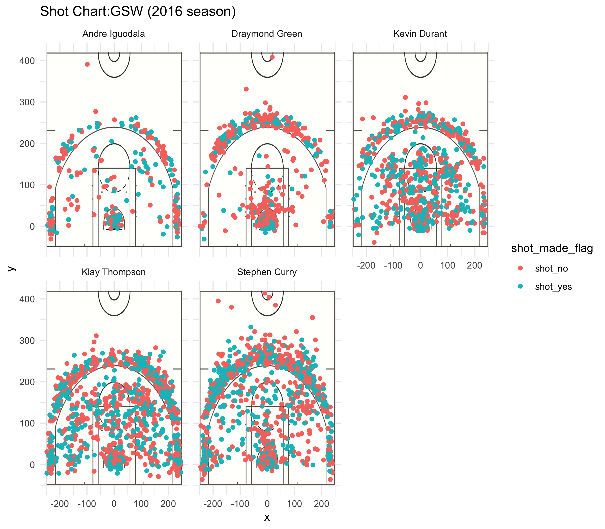

```{r out.width='80%',echo=FALSE,fig.align='center'}


```


```{r}
library(dplyr)
dat_all <- read.csv("../data/shots-data.csv",stringsAsFactors = F)
dat_all <- dat_all[,c(-1)]

dat_twopoint <- dat_all[dat_all$shot_type=="2PT Field Goal",]
dat_2effective <- summarise(group_by(dat_twopoint,name),total=length(name),made=length(which(shot_made_flag=="shot_yes")),perc_made=100*length(which(shot_made_flag=="shot_yes"))/length(name))
dat_2effective <- arrange(dat_2effective,desc(perc_made))
dat_2effective

dat_threepoint <- dat_all[dat_all$shot_type=="3PT Field Goal",]
dat_3effective <- summarise(group_by(dat_threepoint,name),total=length(name),made=length(which(shot_made_flag=="shot_yes")),perc_made=100*length(which(shot_made_flag=="shot_yes"))/length(name))
dat_3effective <- arrange(dat_3effective,desc(perc_made))
dat_3effective

dat_effective <- summarise(group_by(dat_all,name),total=length(name),made=length(which(shot_made_flag=="shot_yes")),perc_made=100*length(which(shot_made_flag=="shot_yes"))/length(name))
dat_effective <- arrange(dat_effective,desc(perc_made))
dat_effective <- dat_effective[c(-6),]
dat_effective
```

```{r eval=FALSE}
is Stephen Curry the most important player in Golden State Warriors?
  
There is no doubt that Stephen Curry is the most popular player in the Golden State Warriors. Every time Curry makes a 3-pointer, the crowd in the arena will celebrate crazily. Curry is like the signature of GSW. However, is Stephen Curry the most important player for the team?
  
As Golden State Warriors otbained Kevin Durant--one of the best players in the league, people start discussing whether Durant or Curry plays a more important role in term of team strategy. What's more, Klay Thompson's clutch performances lead people to think if he should be the most important player in GSW. In this article, I will analyze who is the most important to the team among the five starters.

Firstable, I created a shooting headmap for each of the five starters using 2016 seaon data. From this 5 charts, we can clearly see that Durant, Klay and Curry were taking much more shots than the other 2 starters. It indicates that Durant, Klay and Curry are crucial to the team in the offense end. They are the people contributing to the team  score most. 

To understand further, I analyzed how well they shoot in four aspects which are post shot, mid-range, 3-points and total. In post shot analysis, Kevin Durant took the highest amount of shots with highest percentage made. In the midrange game, Klay Thompson and Kevin Durant perform relatively well. Klay has a slightly better perfomance than Durant with 269 total number of shots and 44.7% percentage made. when it comes to the 3 pointers, Klay is the most accurate 3 point shooters but Curry has highest number of 3 pointers made. So far, we know that Kevin Durant is the best player in GSW when the team decide to attack the basket and that Klay and Curry play important parts in midrange and long distance offense. However, it is still hard to say who is the most important player for GSW. As a result, we look into the overall analysis: Kevin Durant has the highest field-goal percentage(54%) among the five starters, but Curry and Klay are the top 2 player who took the most shots. It implies that Durant might be the most efficient player during the 48 minutes, but Curry and Klay carry heavier burden in the offense end.

Up to till now, there are not sufficient edviences to say who is the most important player in GSW. Even we might say Curry and Klay are more strategically important than Durant in offense, Durant performs better in term of effectiveness. The only thing that I can conclude is that Durant, Curry and Klay are relatively more important in offense end than other 2 starters.

To find out who is the most important player in the team, I did shot analysis for the final 3 minutes of games. The final 3 minutes is the most crucial part in games, especially closed games. Every round in the 3 minutes can alter the final result of the game, so it is reasonable to assume that the team would mainly rely on "the best player/the most important player" during this period. From final 3 minutes shot analysis, it is obvious that Stephen Curry not only have the most attempted shots but also keep the highest field-goal percentage.

As shown, the GSW relies on Stephen Curry the most at the final 3 minutes since Curry have the most attempted shots. Also, Stephen Curry is the most efficient player in final minutes because of the highest field-goal percentage. So, I condlude that at least in offense end Stephen Curry is the most important player in the team.


```

```{r}
#extra analysis for the narrative report
dat_crucial <- dat_all[dat_all$minute>=45,]
dat_crucial_effective <- summarise(group_by(dat_crucial,name),total=length(name),made=length(which(shot_made_flag=="shot_yes")),perc_made=100*length(which(shot_made_flag=="shot_yes"))/length(name))
dat_crucial_effective <- arrange(dat_crucial_effective,desc(perc_made))
dat_crucial_effective
dat_midrange <- dat_all[dat_all$shot_distance>12 & dat_all$shot_distance<18,]
dat_midrange_effective <- summarise(group_by(dat_midrange,name),total=length(name),made=length(which(shot_made_flag=="shot_yes")),perc_made=100*length(which(shot_made_flag=="shot_yes"))/length(name))
dat_midrange_effective <- arrange(dat_midrange_effective,desc(perc_made))
dat_midrange_effective
dat_post <- dat_all[dat_all$shot_distance<10,]
dat_post_effective <- summarise(group_by(dat_post,name),total=length(name),made=length(which(shot_made_flag=="shot_yes")),perc_made=100*length(which(shot_made_flag=="shot_yes"))/length(name))
dat_post_effective <- arrange(dat_post_effective,desc(perc_made))
dat_post_effective
```


